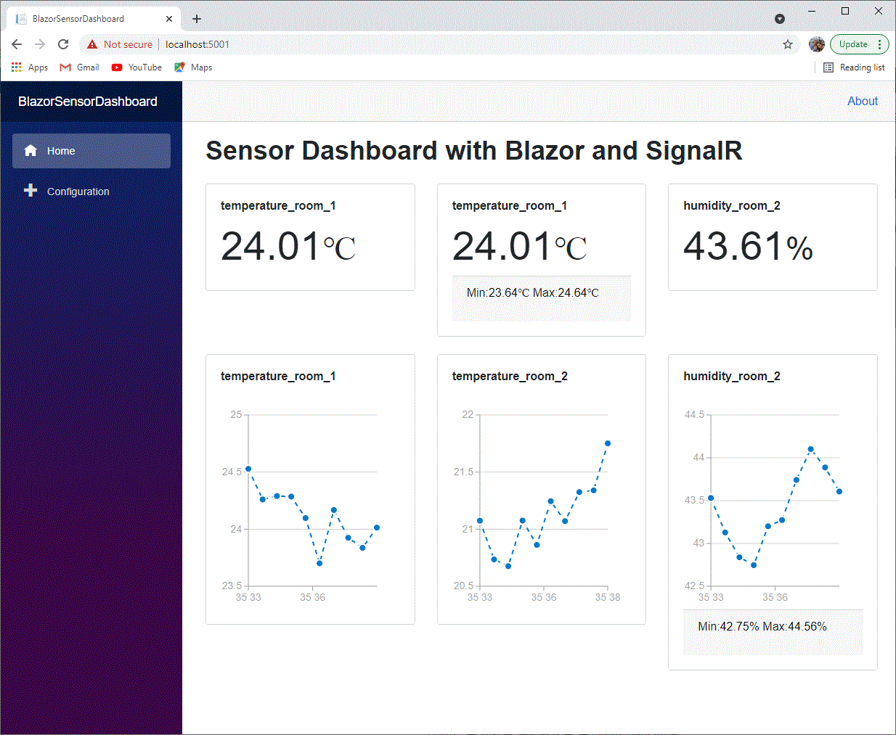
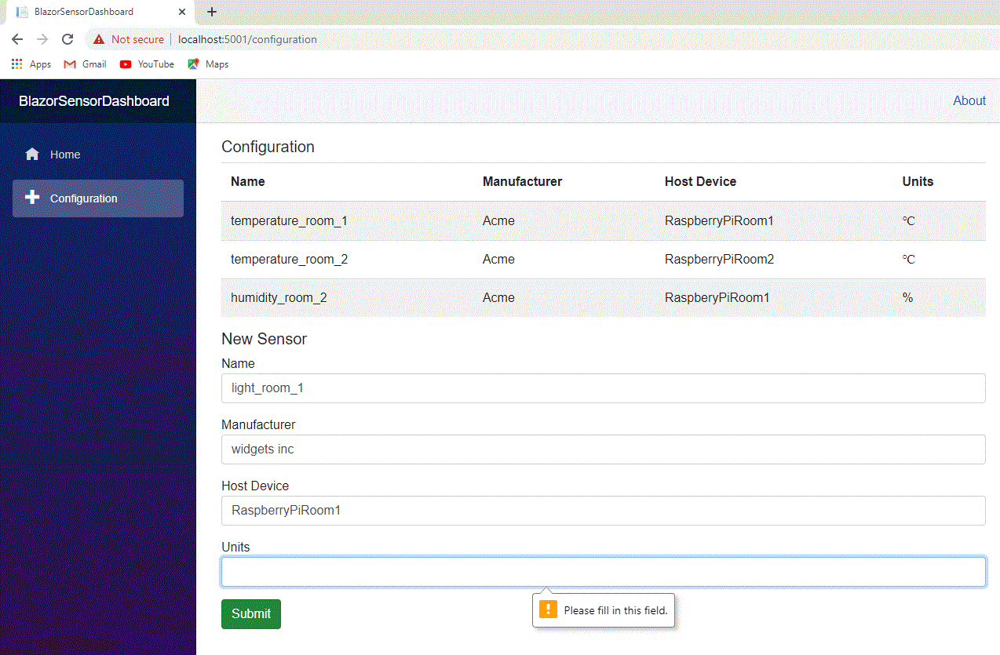

# BlazorSensorDashboard

Simple Sensor Dashboard demo using Blazor WebAssembly, SignalR, RX.net, ASP.NET core.

For the React version of this project see: https://github.com/taumuon/SensorDashboard/
For the Angular version of this project see: https://github.com/taumuon/angular-sensor-dashboard

Build and run with:
dotnet run --project Server
Open browser at https://localhost:5001

NOTE: form handling logic thanks to https://www.dotnetcurry.com/aspnet-core/realtime-app-using-blazor-webassembly-signalr-csharp9

